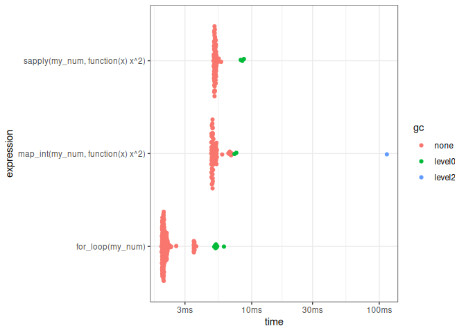

Learning R
================

  - [Introduction](#introduction)
      - [Functional programming](#functional-programming)
      - [Object-Oriented Programming](#object-oriented-programming)
          - [OOP in R](#oop-in-r)
      - [Packages](#packages)
      - [Vectors](#vectors)
          - [Attributes](#attributes)
      - [Lists](#lists)
      - [Functions](#functions)
          - [Function components](#function-components)
          - [Lexical scoping](#lexical-scoping)
          - [Lazy evaluation](#lazy-evaluation)
          - [dot-dot-dot](#dot-dot-dot)
          - [Exiting a function](#exiting-a-function)
          - [Function forms](#function-forms)
      - [Objects](#objects)
      - [Modeling example](#modeling-example)
          - [R formula](#r-formula)
      - [Exceptions](#exceptions)
      - [Measuring performance](#measuring-performance)
          - [Microbenchmarking](#microbenchmarking)
      - [General](#general)
      - [Useful plots](#useful-plots)
      - [Useful tips](#useful-tips)
          - [Getting help](#getting-help)
      - [Hacks](#hacks)
          - [Makevars](#makevars)
          - [Library paths](#library-paths)
          - [Variables and objects](#variables-and-objects)
      - [Session info](#session-info)

# Introduction

The three core features of R are object-orientation, vectorisation, and
its functional programming style.

> "To understand computations in R, two slogans are helpful:
> 
>   - Everything that exists is an object.
>   - Everything that happens is a function call."
> 
> –John Chambers

## Functional programming

See [Advanced
R](https://adv-r.hadley.nz/fp.html#functional-programming-languages).

Functional languages have **first-class functions**, which are functions
that behave like any other data structure. This means that you can do
many of the things with a function that you can do with a vector:

  - You can assigned them to variables,
  - Store them in lists,
  - Pass them as arguments to other functions,
  - Create them inside functions, and
  - Return them as the result of a function.

Secondly, many functional languages requires functions to be **pure**. A
function is pure if it satisfies two properties:

1.  The output only depends on the inputs, i.e. if you call the function
    again with the same inputs, you will get the same outputs.

2.  The function has no side-effects, like changing the value of a
    global variable, writing to disk, or displaying to the screen.

Strictly speaking, R is not a functional programming language because it
does not require you to write pure functions.

Generally a functional style is one where a big problem is decomposed
into smaller pieces, where each piece is solved with a function or
combinations of functions. When using a functional style, you strive to
decompose components of the problem into isolated functions that operate
independently. Each function taken by itself is simple and
straightforward to understand; complexity is handled by composing
functions in various ways.

## Object-Oriented Programming

See [Advanced R](https://adv-r.hadley.nz/oo.html).

Object-Oriented Programming (OOP) is a little more challenging in R
because there are multiple OOP systems to choose from and there is
disagreement about the relative importance of the systems. Hadley
Wickham believes that the most important are S3, R6, and S4 in that
order. S3 and S4 are provided by base R. R6 is provided by the R6
package, and is similar to the Reference Classes, or RC for short, from
base R. S3 and S4 use generic function OOP which is rather different
from the encapsulated OOP used by most languages popular today.

The main reason to use OOP is **polymorphism**. Polymorphism means that
a developer can consider a function’s interface separately from its
implementation, making it possible to use the same function form for
different types of input. This is closely related to the idea of
**encapsulation**: the user doesn’t need to worry about details of an
object because they are encapsulated behind a standard interface.

Polymorphism is what allows summary() to produce different outputs for
numeric and factor variables.

``` r
diamonds <- ggplot2::diamonds
summary(diamonds$carat)
```

    ##    Min. 1st Qu.  Median    Mean 3rd Qu.    Max. 
    ##  0.2000  0.4000  0.7000  0.7979  1.0400  5.0100

``` r
summary(diamonds$cut)
```

    ##      Fair      Good Very Good   Premium     Ideal 
    ##      1610      4906     12082     13791     21551

OO systems call the type of an object its **class**, and an
implementation for a specific class is called a **method**; a class
defines the object and methods describe what the object can do. Classes
are organised in a hierarchy so that if a method does not exist for one
class, its parent’s method is used, and the child is said to **inherit**
behaviour. For example, an ordered factor inherits from a regular
factor, and a generalised linear model inherits from a linear model. The
process of finding the correct method given a class is called **method
dispatch**.

There are two main paradigms of OOP which differ in how methods and
classes are related. We can call these paradigms encapsulated and
functional:

  - In **encapsulated** OOP, methods belong to objects or classes, and
    method calls typically look like `object.method(arg1, arg2)`. This
    is called encapsulated because the object encapsulates both data
    (with fields) and behaviour (with methods), and is the paradigm
    found in most popular languages.

  - In **functional** OOP, methods belong to **generic** functions, and
    method calls look like ordinary function calls: `generic(object,
    arg2, arg3)`. This is called functional because from the outside it
    looks like a regular function call, and internally the components
    are also functions.

### OOP in R

Base R provides three OOP systems: S3, S4, and reference classes (RC):

  - **S3** is R’s first OOP system and is an informal implementation of
    functional OOP. It relies on common conventions rather than ironclad
    guarantees. This makes it easy to get started with, providing a low
    cost way of solving many simple problems.

  - **S4** is a formal and rigorous rewrite of S3. It requires more
    upfront work than S3, but in return provides more guarantees and
    greater encapsulation. S4 is implemented in the base **methods**
    package, which is always installed with R.

(There is no S1 or S2 because S3 and S4 were named according to the
versions of S that they accompanied. The first two versions of S did not
have any OOP framework.)

  - **RC** implements encapsulated OO. RC objects are a special type of
    S4 objects that are also **mutable**, i.e., instead of using R’s
    usual copy-on-modify semantics, they can be modified in place. This
    makes them harder to reason about, but allows them to solve problems
    that are difficult to solve in the functional OOP style of S3 and
    S4.

A number of other OOP systems are provided by CRAN packages:

  - **R6** implements encapsulated OOP like RC, but resolves some
    important issues.

  - **R.oo** provides some formalism on top of S3, and makes it possible
    to have mutable S3 objects.

  - **proto** implements another style of OOP based on the idea of
    **prototypes**, which blur the distinctions between classes and
    instances of classes (objects).

## Packages

If you look up the help page for `require` or `library`, you will be
provided with the “Loading/Attaching and Listing of Packages” help page.
The description is that `library` and `require` load and attach add-on
packages. When you type `library(tidyverse)` the `tidyverse` package is
attached to the search path. It works in the same way as when you add
another directory to your `PATH` environment variable in Linux.

We can use `base::search()` to get the names of environments attached to
the search path.

``` r
base::search()
```

    ## [1] ".GlobalEnv"        "package:stats"     "package:graphics" 
    ## [4] "package:grDevices" "package:utils"     "package:datasets" 
    ## [7] "package:methods"   "Autoloads"         "package:base"

The code below will attach the `tidyverse` and `modeldata` packages
(installing them first if they haven’t been installed yet).

``` r
.libPaths('/packages')
my_packages <- c('tidyverse', 'modeldata', 'bench')

using<-function(...) {
   # https://stackoverflow.com/a/44660688
    libs<-unlist(list(...))
    req<-unlist(lapply(libs,require,character.only=TRUE))
    need<-libs[req==FALSE]
    if(length(need)>0){
        install.packages(need)
        lapply(need,require,character.only=TRUE)
    }
}
using(my_packages)

theme_set(theme_bw())
```

If we run `base::search()` again, we will see the additional packages
attached to the search path.

``` r
base::search()
```

    ##  [1] ".GlobalEnv"        "package:bench"     "package:modeldata"
    ##  [4] "package:lubridate" "package:forcats"   "package:stringr"  
    ##  [7] "package:dplyr"     "package:purrr"     "package:readr"    
    ## [10] "package:tidyr"     "package:tibble"    "package:ggplot2"  
    ## [13] "package:tidyverse" "package:stats"     "package:graphics" 
    ## [16] "package:grDevices" "package:utils"     "package:datasets" 
    ## [19] "package:methods"   "Autoloads"         "package:base"

As for the difference between `library` and `require`?

  - `library` returns an error by default if the package is not
    installed
  - `require` returns a logical depending on whether a package is
    attached or not

This is the reason why `require` was used above to check whether a
package was installed or not.

The difference between attaching and loading is a bit technical and you
can read about it on [SO](https://stackoverflow.com/a/56538266).

## Vectors

R is a vectorised language and what this means is that you can perform
operations on vectors without having to iterate through each element. A
vector is simply “a single entity consisting of a collection of things”
but these items must all belong to the same class. If you try to create
a vector with different classes, the vector will be coerced in the
following order: `logical` \< `integer` \< `numeric` \< `character`.

``` r
my_char <- c(1, 3.14, TRUE, 'str')
class(my_char)
```

    ## [1] "character"

``` r
my_num <- c(1, 2, 3.14, 4)
class(my_num)
```

    ## [1] "numeric"

You can easily square each number in a vector by applying a exponential
function.

``` r
my_int <- 1:6
my_int^2
```

    ## [1]  1  4  9 16 25 36

You can operate on a vector using another vector too. If the right
vector isn’t the same length as the left vector but is a multiple, R
performs a procedure called “recycling” that will re-use the right
vector on the next set of values.

``` r
my_int + c(1, 2)
```

    ## [1] 2 4 4 6 6 8

Named vectors (see [Attributes](#attributes)) can be used as simple
lookup tables. Make sure that the names are unique and non-missing.

``` r
my_lookup <- c(
  "HKG" = "Hong Kong",
  "PNG" = "Papua New Guinea",
  "AUS" = "Australia",
  "JPN" = "Japan"
)

my_lookup["PNG"]
```

    ##                PNG 
    ## "Papua New Guinea"

### Attributes

Attributes can be considered as name-value pairs that attach metadata to
an object. Individual attributes can be retrieved and modified with
`attr()` or retrieved en masse with `attributes()`, and set en masse
with `structure()`.

``` r
a <- 1:3
attr(a, "x") <- "abcdef"
attr(a, "x")
```

    ## [1] "abcdef"

``` r
attr(a, "y") <- 4:6
str(attributes(a))
```

    ## List of 2
    ##  $ x: chr "abcdef"
    ##  $ y: int [1:3] 4 5 6

``` r
a <- structure(
  1:3,
  x = "abcdef",
  y = 4:6
)
str(attributes(a))
```

    ## List of 2
    ##  $ x: chr "abcdef"
    ##  $ y: int [1:3] 4 5 6

Attributes should generally be thought of as ephemeral. There are only
two attributes that are routinely preserved:

  - **names**, a character vector giving each element a name.
  - **dim**, short for dimensions, an integer vector, used to turn
    vectors into matrices or arrays.

To preserve other attributes, you will need to create your own S3 class.

Vectors can be named in three ways.

1.  When creating it.

<!-- end list -->

``` r
x <- c(a = 1, b = 2, c = 3)
```

2.  By assigning a character vector to `names()`.

<!-- end list -->

``` r
x <- 1:3
names(x) <- c('a', 'b', 'c')
```

3.  Using `setNames()`.

<!-- end list -->

``` r
x <- setNames(1:3, c('a', 'b', 'c'))
```

Avoid using `attr(x, 'names')` as it requires more typing and is less
readable than `names(x)`. Names can be removed using `x <- unname(x)` or
`names(x) <- NULL`.

Adding a `dim` attribute to a vector allows it to behave like a
2-dimensional **matrix** or a multi-dimensional **array**. However,
matrices and arrays are primarily mathematical and statistical tools,
not programming tools.

Matrices and arrays can be created using `matrix()` and `array()` or by
using the assignment form of `dim()`.

``` r
x <- matrix(1:6, nrow = 2, ncol = 3)
x
```

    ##      [,1] [,2] [,3]
    ## [1,]    1    3    5
    ## [2,]    2    4    6

``` r
y <- array(1:12, c(2, 3, 2))
y
```

    ## , , 1
    ## 
    ##      [,1] [,2] [,3]
    ## [1,]    1    3    5
    ## [2,]    2    4    6
    ## 
    ## , , 2
    ## 
    ##      [,1] [,2] [,3]
    ## [1,]    7    9   11
    ## [2,]    8   10   12

``` r
z <- 1:6
dim(z) <- c(2, 3)
z
```

    ##      [,1] [,2] [,3]
    ## [1,]    1    3    5
    ## [2,]    2    4    6

## Lists

Unlike vectors, lists can be used to store heterogeneous things.

``` r
my_list <- list(
  my_func = function(x){x^2},
  my_df = data.frame(a = 1:3),
  my_vec = 1:6
)

my_list$my_func(my_list$my_vec)
```

    ## [1]  1  4  9 16 25 36

`lapply` can be used to apply a function to each item in a list and will
return a list.

``` r
my_list <- list(
  a = 1:3,
  b = 4:10,
  c = 11:20
)

lapply(my_list, sum)
```

    ## $a
    ## [1] 6
    ## 
    ## $b
    ## [1] 49
    ## 
    ## $c
    ## [1] 155

Another handy function is the `do.call` function, which constructs and
executes a function call on a list. The example below is useful for
converting a list into a matrix.

``` r
my_list <- list(
  a = 1:3,
  b = 4:6,
  c = 7:9
)

# returns a matrix
do.call(what = rbind, args = my_list)
```

    ##   [,1] [,2] [,3]
    ## a    1    2    3
    ## b    4    5    6
    ## c    7    8    9

Use `utils::stack` to create a data frame from a named list; the vectors
are concatenated and the names are used to create factors.

``` r
utils::stack(my_list)
```

    ##   values ind
    ## 1      1   a
    ## 2      2   a
    ## 3      3   a
    ## 4      4   b
    ## 5      5   b
    ## 6      6   b
    ## 7      7   c
    ## 8      8   c
    ## 9      9   c

There is also the
[purrr::map](https://purrr.tidyverse.org/reference/map.html) function,
that is
[similar](https://jennybc.github.io/purrr-tutorial/ls01_map-name-position-shortcuts.html)
to the apply functions in base R, but you explicitly specify the output
type. The `map_lgl` function will return logicals, i.e. Booleans.

``` r
map_lgl(.x = 1:10, .f = function(x) x > 5)
```

    ##  [1] FALSE FALSE FALSE FALSE FALSE  TRUE  TRUE  TRUE  TRUE  TRUE

## Functions

Notes from [Advanced R](https://adv-r.hadley.nz/functions.html).

Two important ideas about functions in R need to be understood:

1.  Functions can be broken down into three components: arguments, body,
    and environment

2.  Functions are objects, just as vectors are objects

R functions are objects in their own right, a language property often
called “first-class functions”.

### Function components

A function has three parts:

1.  The `formals()`, which are the list of arguments that control how
    you call the function.

2.  The `body()`, which is the code inside the function.

3.  The `environment()`, which is the data structure that determines the
    namespace.

The environment is based on where you define the function.

``` r
f02 <- function(x, y){
  # comment
  x + y
}

formals(f02)
```

    ## $x
    ## 
    ## 
    ## $y

``` r
body(f02)
```

    ## {
    ##     x + y
    ## }

``` r
environment(f02)
```

    ## <environment: R_GlobalEnv>

Functions contain any number of additional `attributes()` as with all
objects in R. One attribute used by base R is `srcref`, which points to
the source code used to create the function.

``` r
attr(f02, "srcref")
```

    ## function(x, y){
    ##   # comment
    ##   x + y
    ## }

However primitive functions do not have the three components (they
return `NULL`) and call C code directly.

``` r
sum
```

    ## function (..., na.rm = FALSE)  .Primitive("sum")

Primitive functions have either type `builtin` or type `special` but
have class `function`.

``` r
class(f02)
```

    ## [1] "function"

``` r
class(sum)
```

    ## [1] "function"

``` r
class(`[`)
```

    ## [1] "function"

``` r
typeof(f02)
```

    ## [1] "closure"

``` r
typeof(sum)
```

    ## [1] "builtin"

``` r
typeof(`[`)
```

    ## [1] "special"

### Lexical scoping

Scoping is the act of finding the value associated with a name. R uses
lexical scoping, which means it looks up the values of names based on
how a function is defined and not by how it is called. Lexical in this
context means that the scoping rules use a parse-time, rather than a
run-time, structure. R’s lexical scoping follows four primary rules:

1.  Name masking
2.  Functions versus variables
3.  A fresh start - each time you invoke a function, it starts fresh
4.  Dynamic lookup

The basic principle of lexical scoping is that names defined inside a
function mask names defined outside a function. If a name is not defined
inside a function, R looks one level up (all the way up to the global
environment). Lexical scoping determines where, but not when to look for
values. *R looks for values when the function is run and not when the
function is created*.

### Lazy evaluation

Function arguments are only evaluated if accessed, i.e. lazily
evaluated. This is a nice feature because it allows the inclusion of
potentially expensive computations in function arguments that will only
be evaluated if necessary.

Lazy evaluation is powered by a data structure called a **promise**,
which has three components:

1.  An expression, like `x + y`, which gives rise to the delayed
    computation.

2.  An environment where the expression should be evaluated, i.e. the
    environment where the function is called.

3.  A value, which is computed and cached the first time a promise is
    accessed when the expression is evaluated in the specified
    environment.

### dot-dot-dot

Functions can have a special argument `...`, which is pronounced
dot-dot-dot. In other programming languages, this type of argument is
often called `varargs` (variable arguments) and a function that uses it
is said to be variadic.

``` r
i01 <- function(y, z) {
  list(y = y, z = z)
}

i02 <- function(x, ...) {
  i01(...)
}

str(i02(x = 1, y = 2, z = 3))
```

    ## List of 2
    ##  $ y: num 2
    ##  $ z: num 3

The `...` is useful when a function takes a function as an argument: you
can pass additional arguments to that function. The downside of using
`...` is that when arguments are used to pass arguments to another
function, it is sometimes not clear to the user. Also a misspelled
argument will not raise an error and this makes it easy for typos to go
unnoticed.

### Exiting a function

Most functions exit in one of two ways:

1.  They either return a value, indicating success. There are two ways a
    function can return a value:
    1.  Implicitly, where the last evaluated expression is returned.
    2.  Explicitly by using `return()`.
2.  They throw an error, indicating failure.

Most functions return visibly, meaning that the result is printed when
evaluated in an interactive context. The automatic printing can be
prevented by using `invisible()` but the return value still exists.

If a function cannot complete its assigned task, it should throw an
error with `stop()`, which immediately terminates the execution of the
function. `on.exit()` can be used to run some code regardless of how a
function exits; always set `add = TRUE` when using `on.exit()` because
if you don’t each call to `on.exit()` will overwrite the previous exit
handler.

### Function forms

Function calls come in four varieties:

1.  **prefix**: the function name comes before its arguments,
    e.g. `sum(1:5)`. These constitute the majority of function calls in
    R

2.  **infix**: the function name comes in between its arguments, e.g. `x
    + y`. Infix forms are used for many mathematical operators and for
    user-defined functions that begin and end with `%`.

3.  **replacement**: functions that replace values by assignment, e.g.
    `names(my_df) <- c('a', 'b', 'c')`.

4.  **special**: functions like `[[`, `if`, and `for` that do not have a
    consistent structure.

All functions can be written in prefix form.

``` r
x <- 1900
y <- 84
x + y
```

    ## [1] 1984

``` r
`+`(x, y)
```

    ## [1] 1984

``` r
df <- data.frame(a = 1, b = 2, c= 3)
`names<-`(df, c("x", "y", "z"))
```

    ##   x y z
    ## 1 1 2 3

``` r
for(i in 1:3) print(i)
```

    ## [1] 1
    ## [1] 2
    ## [1] 3

``` r
`for`(i, 1:3, print(i))
```

    ## [1] 1
    ## [1] 2
    ## [1] 3

## Objects

[Base types](https://adv-r.hadley.nz/base-types.html).

## Modeling example

Notes from [Tidy Modeling with R](https://www.tmwr.org/base-r.html).

Load `crickets` data set that contains the relationship between the
ambient temperature and the rate of cricket chirps per minute for two
species.

``` r
data(crickets, package = "modeldata")
head(crickets)
```

    ## # A tibble: 6 × 3
    ##   species           temp  rate
    ##   <fct>            <dbl> <dbl>
    ## 1 O. exclamationis  20.8  67.9
    ## 2 O. exclamationis  20.8  65.1
    ## 3 O. exclamationis  24    77.3
    ## 4 O. exclamationis  24    78.7
    ## 5 O. exclamationis  24    79.4
    ## 6 O. exclamationis  24    80.4

Plot.

``` r
ggplot(
  crickets, 
  aes(x = temp, y = rate, color = species, pch = species, lty = species)
) + 
  geom_point(size = 2) + 
  geom_smooth(method = lm, se = FALSE, alpha = 0.5) + 
  scale_color_brewer(palette = "Paired") +
  labs(x = "Temperature (C)", y = "Chirp Rate (per minute)")
```

    ## `geom_smooth()` using formula = 'y ~ x'

<!-- -->

For an inferential model, we might have specified the following null
hypotheses prior to seeing the data:

  - Temperature has no effect on the chirp rate
  - There are no differences between the species’ chirp rate.

The `lm()` function is commonly used to fit an ordinary linear model.
Arguments to this function are a model formula and the data frame that
contains the data. The formula is *symbolic*; the simple formula below
specifies that the chirp rate is the outcome and the temperature is the
predictor.

``` r
rate ~ temp
```

    ## rate ~ temp

If the time of day was also recorded in a column called `time`, the
following formula does not add the time and temperature values together
but the formula symbolically represents that temperature and time should
be added as separate *main effects* to the model. A main effect is a
model term that contains a single predictor variable.

``` r
rate ~ temp + time
```

    ## rate ~ temp + time

We can add the species to the model in the same way but since species is
not a quantitative variable, an *indicator variable* (also known as a
dummy variable) is used in place of the original qualitative value. The
model formula will automatically encode `species` as a numeric by adding
a new column that has a value of zero and one for the two species.

``` r
rate ~ temp + species
```

    ## rate ~ temp + species

The model formula `rate ~ temp + species` creates a model with different
y-intercepts for each species; the slopes of the regression lines could
be different for each species as well. To accommodate this structure, an
interaction term can be added to the model. This can be specified in a
few different ways and the most basic uses the colon.

``` r
rate ~ temp + species + temp:species
```

    ## rate ~ temp + species + temp:species

``` r
# A shortcut can be used to expand all interactions containing
# interactions with two variables:
rate ~ (temp + species)^2
```

    ## rate ~ (temp + species)^2

``` r
# Another shortcut to expand factors to include all possible
# interactions (equivalent for this example):
rate ~ temp * species
```

    ## rate ~ temp * species

The model formula also has other nice features:

  - *In-line* functions can be used, e.g. to use the natural log of the
    temperature, we can use the formula `rate ~ log(temp)`

  - R has many functions that are useful inside formulas,
    e.g. `poly(x, 3)` adds linear, quadratic, and cubic terms for `x`
    to the model as main effects.

  - The period shortcut is available for data sets with many predictors.
    The period represents main effects for all of the columns that are
    not on the left-hand side of the tilde.

Use a two-way interaction model.

``` r
interaction_fit <- lm(rate ~ (temp + species)^2, data = crickets)

interaction_fit
```

    ## 
    ## Call:
    ## lm(formula = rate ~ (temp + species)^2, data = crickets)
    ## 
    ## Coefficients:
    ##           (Intercept)                   temp       speciesO. niveus  
    ##               -11.041                  3.751                 -4.348  
    ## temp:speciesO. niveus  
    ##                -0.234

Now we will recompute the model without the interaction term to assess
whether the interaction term is necessary using the `anova()` method.

``` r
main_effect_fit <- lm(rate ~ temp + species, data = crickets)

anova(main_effect_fit, interaction_fit)
```

    ## Analysis of Variance Table
    ## 
    ## Model 1: rate ~ temp + species
    ## Model 2: rate ~ (temp + species)^2
    ##   Res.Df    RSS Df Sum of Sq     F Pr(>F)
    ## 1     28 89.350                          
    ## 2     27 85.074  1    4.2758 1.357 0.2542

This statistical test generates a p-value of 0.25, which implies that
there is a lack of evidence against the null hypothesis that the
interaction term is not needed by the model.

The `summary()` method can be used to inspect the coefficients, standard
errors, and p-values of each model term.

``` r
summary(main_effect_fit)
```

    ## 
    ## Call:
    ## lm(formula = rate ~ temp + species, data = crickets)
    ## 
    ## Residuals:
    ##     Min      1Q  Median      3Q     Max 
    ## -3.0128 -1.1296 -0.3912  0.9650  3.7800 
    ## 
    ## Coefficients:
    ##                   Estimate Std. Error t value Pr(>|t|)    
    ## (Intercept)       -7.21091    2.55094  -2.827  0.00858 ** 
    ## temp               3.60275    0.09729  37.032  < 2e-16 ***
    ## speciesO. niveus -10.06529    0.73526 -13.689 6.27e-14 ***
    ## ---
    ## Signif. codes:  0 '***' 0.001 '**' 0.01 '*' 0.05 '.' 0.1 ' ' 1
    ## 
    ## Residual standard error: 1.786 on 28 degrees of freedom
    ## Multiple R-squared:  0.9896, Adjusted R-squared:  0.9888 
    ## F-statistic:  1331 on 2 and 28 DF,  p-value: < 2.2e-16

The chirp rate for each species increases by 3.6 chirps as the
temperature increases by a single degree. This term shows strong
statistical sifnificance as evidenced by the p-value. The species term
has a value of -10.07, which indicates that, across all temperature
values, *O. niveus* has a chirp rate that is about 10 fewer chirps per
minute than *O. exclamationis*. The species effect is also associated
with a very small p-value.

The only issue in this analysis is the intercept value that indicates
that at 0 degrees Celsius, there are negative chirps per minute for both
species. The data only goes as low as 17.2 degrees Celsius and therefore
the conclusions should be limited to the observed temperature range.

If we needed to estimate the chirp rate at a temperature that was not
observed in the experiment, we could use the `predict()` method, which
takes the model object and a data frame of new values for prediction.

``` r
new_values <- data.frame(species = "O. exclamationis", temp = 15:20)
predict(main_effect_fit, new_values)
```

    ##        1        2        3        4        5        6 
    ## 46.83039 50.43314 54.03589 57.63865 61.24140 64.84415

### R formula

The R model formula is used by many modeling packages and it usually
serves multiple purposes:

  - The formula defines the columns that the model uses.

  - The standard R machinery uses the formula to encode the columns into
    an appropriate format, e.g. create indicator variables.

  - The roles of the columns are defined by the formula.

For example, the following formula indicates that there are two
predictors and the model should contain their main effects and the
two-way interactions.

``` r
rate ~ (temp + species)^2
```

    ## rate ~ (temp + species)^2

## Exceptions

Notes from [Debugging, condition handling, and defensive
programming](http://adv-r.had.co.nz/Exceptions-Debugging.html).

`try()` gives you the ability to continue execution even when an error
occurs.

``` r
try_log <- function(x) {
  try(log(x))
  10
}

try_log('a')
```

    ## Error in log(x) : non-numeric argument to mathematical function

    ## [1] 10

`tryCatch()` is a general tool for handling conditions: in addition to
errors, you can take different actions for warnings, messages, and
interrupts.

``` r
show_condition <- function(code) {
  tryCatch(
    code,
    error = function(x) "error",
    warning = function(x) "warning",
    message = function(x) "message"
  )
}

show_condition(log('a'))
```

    ## [1] "error"

``` r
show_condition(stop("!"))
```

    ## [1] "error"

``` r
show_condition(stopifnot(2 + 2 == 5))
```

    ## [1] "error"

``` r
show_condition(stopifnot(4 + 1980 == 1984))
show_condition(warning("?!"))
```

    ## [1] "warning"

``` r
show_condition(message("?"))
```

    ## [1] "message"

``` r
show_condition(10)
```

    ## [1] 10

## Measuring performance

Notes from [Measuring
performance](https://adv-r.hadley.nz/perf-measure.html).

### Microbenchmarking

A
[microbenchmark](https://adv-r.hadley.nz/perf-measure.html#microbenchmarking)
is a measurement of the performance of a very small piece of code,
something that might take milliseconds, microseconds, or nanoseconds to
run.

``` r
set.seed(1984)
x <- runif(100)
(lb <- bench::mark(
  sqrt(x),
  x ^ 0.5
))
```

    ## # A tibble: 2 × 6
    ##   expression      min   median `itr/sec` mem_alloc `gc/sec`
    ##   <bch:expr> <bch:tm> <bch:tm>     <dbl> <bch:byt>    <dbl>
    ## 1 sqrt(x)    343.08ns  375.6ns  1369316.      848B        0
    ## 2 x^0.5        2.15µs    2.2µs   380237.      848B        0

`for` versus `map_int` versus `sapply`.

``` r
my_num <- 1:10000
for_loop <- function(n){
  v <- vector(mode = "integer")
  for(i in n){
    v[i] <- i^2
  }
  return(v)
}

(ms <- bench::mark(
  for_loop(my_num),
  map_int(my_num, function(x) x^2),
  sapply(my_num, function(x) x^2)
))
```

    ## # A tibble: 3 × 6
    ##   expression                            min  median `itr/sec` mem_alloc `gc/sec`
    ##   <bch:expr>                       <bch:tm> <bch:t>     <dbl> <bch:byt>    <dbl>
    ## 1 for_loop(my_num)                   2.12ms  2.18ms      445.    1.69MB    23.3 
    ## 2 map_int(my_num, function(x) x^2)   5.18ms  5.56ms      181.   47.97KB     6.31
    ## 3 sapply(my_num, function(x) x^2)     5.2ms  5.59ms      178.  367.85KB     6.44

  - `min` - The minimum execution time.
  - `median` - The sample median of execution time.
  - `itr/sec` - The estimated number of executions performed per second.
  - `mem_alloc` - Total amount of memory allocated by R while running
    the expression.
  - `gc/sec` - The number of garbage collections per second.
  - `n_itr` - Total number of iterations after filtering garbage
    collections (if filter\_gc == TRUE).
  - `n_gc` - Total number of garbage collections performed over all
    iterations.
  - `total_time` - The total time to perform the benchmarks.
  - `result` - A list column of the object(s) returned by the evaluated
    expression(s).
  - `memory` - A list column with results from Rprofmem().
  - `time` - A list column of bench\_time vectors for each evaluated
    expression.
  - `gc` - A list column with tibbles containing the level of garbage
    collection (0-2, columns) for each iteration (rows).

<!-- end list -->

``` r
plot(ms)
```

<!-- -->

Use `system.time` to measure CPU time.

``` r
system.time(
  x <- replicate(1000, for_loop(my_num))
)
```

    ##    user  system elapsed 
    ##   4.125   0.078   4.214

``` r
system.time(
  y <- replicate(1000, map_int(my_num, function(x) x^2))
)
```

    ##    user  system elapsed 
    ##   5.806   0.032   5.852

``` r
system.time(
  z <- replicate(1000, sapply(my_num, function(x) x^2))
)
```

    ##    user  system elapsed 
    ##   6.010   0.088   6.112

``` r
all.equal(x, y)
```

    ## [1] TRUE

``` r
all.equal(x, z)
```

    ## [1] TRUE

## General

Assign a data frame column `NULL` to delete it.

``` r
my_df <- data.frame(
  a = 1:3,
  b = 4:6,
  c = c(6, 6, 6)
)

my_df$c <- NULL

my_df
```

    ##   a b
    ## 1 1 4
    ## 2 2 5
    ## 3 3 6

Include an additional directory (`/packages`) to look for and install R
packages.

``` r
.libPaths('/packages')
```

Use `identical` to check whether two objects are exactly equal. Most
times it should suffice to just use `all.equal`.

``` r
first <- 1:5
second <- c(1, 2, 3, 4, 5)

# this is false because first is a vector of integers
# and second is a vector of numerics
identical(first, second)
```

    ## [1] FALSE

``` r
all.equal(first, second)
```

    ## [1] TRUE

Set `scipen` (default is 0), which is a penalty to be applied when
deciding to print numeric values in fixed or exponential notation, to
determine when to print in exponential notation. (`.Options` contains
all other options settings.)

``` r
options(scipen=0)
10e4
```

    ## [1] 1e+05

``` r
options(scipen=1)
10e4
```

    ## [1] 100000

Use `system.time()` to measure how long a block of codes takes to
execute.

``` r
system.time(
  for (i in 1:100000000){}
)
```

    ##    user  system elapsed 
    ##   1.464   0.000   1.467

The `with` function evaluates an expression with data.

``` r
my_df <- data.frame(
  a=1:10,
  b=11:20,
  c=21:30
)
wanted <- with(my_df, a > 5 & c > 27)
my_df[wanted, ]
```

    ##     a  b  c
    ## 8   8 18 28
    ## 9   9 19 29
    ## 10 10 20 30

The `which` function is a very useful for returning indicates that are
`TRUE` and works with matrices.

``` r
my_mat <- matrix(1:9, nrow=3, byrow = TRUE)

# note that the results are ordered by col
which(my_mat > 5, arr.ind = TRUE)
```

    ##      row col
    ## [1,]   3   1
    ## [2,]   3   2
    ## [3,]   2   3
    ## [4,]   3   3

The `match` function can be used with vectors to return the indexes of
matching items and an `NA` is no match was found.

``` r
x <- c('b', 'c', 'a', 'd')
y <- letters[1:3]

match(x, y)
```

    ## [1]  2  3  1 NA

You can use `match` to subset and order a data frame.

``` r
my_df <- data.frame(
  a = 1:10,
  b = letters[1:10]
)

x <- c(2, 10, 5, 6)
x_match <- match(x, my_df$a)

my_df[x_match, ]
```

    ##     a b
    ## 2   2 b
    ## 10 10 j
    ## 5   5 e
    ## 6   6 f

Use the `complete.cases` function to list observations that have no
missing values, i.e. NA values.

``` r
my_df <- data.frame(
  a = 1:3,
  b = c(4, NA, 6),
  c = 7:9
)

complete.cases(my_df)
```

    ## [1]  TRUE FALSE  TRUE

Use `commandArgs` to accept command line arguments without having to
install an external package like `optparse`.

``` r
args <- commandArgs(TRUE)
```

## Useful plots

Visualise a table.

``` r
mosaicplot(table(ChickWeight$Time, ChickWeight$Diet), main = "Timepoint versus diet")
```

<!-- -->

## Useful tips

A lot of R books are free to read; check out the
[bookdown](https://bookdown.org/) page to see some of the best R books.

R has four special values:

1.  `NA` - used for representing missing data.
2.  `NULL` - represents not having a value and unlike `NA`, it is its
    own object and cannot be used in a vector.
3.  `Inf`/`-Inf` - used for representing numbers too big for R (see
    below).
4.  `NaN` - used for storing results that are not a number.

Check the `.Machine` variable to find out the numerical characteristics
of the machine R is running on, such as the largest double or integer
and the machine’s precision.

``` r
noquote(unlist(format(.Machine)))
```

    ##                double.eps            double.neg.eps               double.xmin 
    ##              2.220446e-16              1.110223e-16             2.225074e-308 
    ##               double.xmax               double.base             double.digits 
    ##             1.797693e+308                         2                        53 
    ##           double.rounding              double.guard         double.ulp.digits 
    ##                         5                         0                       -52 
    ##     double.neg.ulp.digits           double.exponent            double.min.exp 
    ##                       -53                        11                     -1022 
    ##            double.max.exp               integer.max               sizeof.long 
    ##                      1024                2147483647                         8 
    ##           sizeof.longlong         sizeof.longdouble            sizeof.pointer 
    ##                         8                        16                         8 
    ##             sizeof.time_t            longdouble.eps        longdouble.neg.eps 
    ##                         8              1.084202e-19              5.421011e-20 
    ##         longdouble.digits       longdouble.rounding          longdouble.guard 
    ##                        64                         5                         0 
    ##     longdouble.ulp.digits longdouble.neg.ulp.digits       longdouble.exponent 
    ##                       -63                       -64                        15 
    ##        longdouble.min.exp        longdouble.max.exp 
    ##                    -16382                     16384

When asking for help online, it is useful to include a minimal example
that includes some data specific to your question. To easily convert
data into code, use the `dput()` function. The example below is just for
illustrative purposes since the `women` dataset is included with R, so
you would not need to generate code for it.

``` r
dput(women)
```

    ## structure(list(height = c(58, 59, 60, 61, 62, 63, 64, 65, 66, 
    ## 67, 68, 69, 70, 71, 72), weight = c(115, 117, 120, 123, 126, 
    ## 129, 132, 135, 139, 142, 146, 150, 154, 159, 164)), class = "data.frame", row.names = c(NA, 
    ## -15L))

Show all the functions of a package.

``` r
ls("package:stringr")
```

    ##  [1] "%>%"               "boundary"          "coll"             
    ##  [4] "fixed"             "fruit"             "invert_match"     
    ##  [7] "regex"             "sentences"         "str_c"            
    ## [10] "str_conv"          "str_count"         "str_detect"       
    ## [13] "str_dup"           "str_ends"          "str_equal"        
    ## [16] "str_escape"        "str_extract"       "str_extract_all"  
    ## [19] "str_flatten"       "str_flatten_comma" "str_glue"         
    ## [22] "str_glue_data"     "str_interp"        "str_length"       
    ## [25] "str_like"          "str_locate"        "str_locate_all"   
    ## [28] "str_match"         "str_match_all"     "str_order"        
    ## [31] "str_pad"           "str_rank"          "str_remove"       
    ## [34] "str_remove_all"    "str_replace"       "str_replace_all"  
    ## [37] "str_replace_na"    "str_sort"          "str_split"        
    ## [40] "str_split_1"       "str_split_fixed"   "str_split_i"      
    ## [43] "str_squish"        "str_starts"        "str_sub"          
    ## [46] "str_sub_all"       "str_sub<-"         "str_subset"       
    ## [49] "str_to_lower"      "str_to_sentence"   "str_to_title"     
    ## [52] "str_to_upper"      "str_trim"          "str_trunc"        
    ## [55] "str_unique"        "str_view"          "str_view_all"     
    ## [58] "str_which"         "str_width"         "str_wrap"         
    ## [61] "word"              "words"

Search is useful to list the search path, i.e. where R will look, for R
objects such as functions.

``` r
search()
```

    ##  [1] ".GlobalEnv"        "package:bench"     "package:modeldata"
    ##  [4] "package:lubridate" "package:forcats"   "package:stringr"  
    ##  [7] "package:dplyr"     "package:purrr"     "package:readr"    
    ## [10] "package:tidyr"     "package:tibble"    "package:ggplot2"  
    ## [13] "package:tidyverse" "package:stats"     "package:graphics" 
    ## [16] "package:grDevices" "package:utils"     "package:datasets" 
    ## [19] "package:methods"   "Autoloads"         "package:base"

### Getting help

Get help on a class.

``` r
?"numeric-class"
```

Get information on a package.

``` r
library(help="stringr")
```

Finding out what methods are available for a class.

``` r
methods(class="lm")
```

    ##  [1] add1           alias          anova          case.names     coerce        
    ##  [6] confint        cooks.distance deviance       dfbeta         dfbetas       
    ## [11] drop1          dummy.coef     effects        extractAIC     family        
    ## [16] formula        fortify        hatvalues      influence      initialize    
    ## [21] kappa          labels         logLik         model.frame    model.matrix  
    ## [26] nobs           plot           predict        print          proj          
    ## [31] qqnorm         qr             residuals      rstandard      rstudent      
    ## [36] show           simulate       slotsFromS3    summary        variable.names
    ## [41] vcov          
    ## see '?methods' for accessing help and source code

Search the help pages.

``` r
help.search("cross tabulate")
```

Search for function containing keyword.

``` r
apropos("mutate")
```

    ## [1] "mutate"       "mutate_"      "mutate_all"   "mutate_at"    "mutate_each" 
    ## [6] "mutate_each_" "mutate_if"

## Hacks

There are probably better ways to do the following, which is why I have
labelled them as hacks, so follow at your own peril.

### Makevars

You can set/modify preprocessor options (for example include paths and
definitions) for C/C++ files using a
[Makevars](https://cran.r-project.org/doc/manuals/r-devel/R-exts.html#Using-Makevars)
file. I had a problem [installing the ranger
package](https://github.com/imbs-hl/ranger/issues/669) because R (my
version is 4.3.0) sets the default C++
[standard](https://gcc.gnu.org/projects/cxx-status.html) to C++11 and
`ranger` requires C++14. I wrote this Bash snippet (I use a Bash script
to install my packages) to overcome this problem.

``` bash
makevars=${HOME}/.R/Makevars
if [[ ! -e ${makevars} ]]; then
   mkdir -p ${HOME}/.R
   touch ${makevars} && echo "CXX = g++ -std=gnu++14" >> ${makevars}
   install_ranger
   rm ${makevars}
else
   if [[ $(grep -c "^CXX = g++ -std=gnu++14\b") == 0 ]]; then
      cp ${makevars} ${HOME}/.R/Makevars_bk
      echo "CXX = g++ -std=gnu++14" >> ${makevars}
      install_ranger
      mv -f ${HOME}/.R/Makevars_bk ${makevars}
   fi
fi
```

### Library paths

Some R packages require libraries not included in the default library
path. Use `Sys.setenv` to include additional library paths. First we’ll
get the default path.

``` r
Sys.getenv("LD_LIBRARY_PATH")
```

    ## [1] "/usr/local/lib/R/lib:/usr/local/lib:/usr/lib/x86_64-linux-gnu:/usr/lib/jvm/java-11-openjdk-amd64/lib/server"

Now we will add `/usr/include` to `LD_LIBRARY_PATH` and get the updated
library path.

``` r
new_path <- paste0(Sys.getenv("LD_LIBRARY_PATH"), ":", "/usr/include")
Sys.setenv("LD_LIBRARY_PATH" = new_path)
Sys.getenv("LD_LIBRARY_PATH")
```

    ## [1] "/usr/local/lib/R/lib:/usr/local/lib:/usr/lib/x86_64-linux-gnu:/usr/lib/jvm/java-11-openjdk-amd64/lib/server:/usr/include"

### Variables and objects

Sometimes you want to create objects with values stored in variables.
This can be achieved using `assign()`.

``` r
my_varname <- 'one_to_ten'
my_values <- 1:10
assign(my_varname, my_values)

one_to_ten
```

    ##  [1]  1  2  3  4  5  6  7  8  9 10

Likewise, sometimes you want to store an object’s name into a variable.
This can be achieved using `substitute` (returns the parse tree for an
unevaluated expression) and `deparse` (turns unevaluated expressions
into character strings).

``` r
obj_to_string <- function(x){
   deparse(substitute(x))
}

my_obj_name <- 1984
my_var <- obj_to_string(my_obj_name)

my_var
```

    ## [1] "my_obj_name"

To evaluating a string, use `parse` (returns an unevaluated expression)
with a `text` argument specifying the character vector and `eval`
(evaluates an unevaluated expression).

``` r
eval(parse(text = my_var))
```

    ## [1] 1984

## Session info

This README was generated by running `rmd_to_md.sh` with `readme.Rmd`.

    ## [1] "2023-08-03 01:27:28 UTC"

Session info.

    ## R version 4.3.0 (2023-04-21)
    ## Platform: x86_64-pc-linux-gnu (64-bit)
    ## Running under: Ubuntu 22.04.2 LTS
    ## 
    ## Matrix products: default
    ## BLAS:   /usr/lib/x86_64-linux-gnu/openblas-pthread/libblas.so.3 
    ## LAPACK: /usr/lib/x86_64-linux-gnu/openblas-pthread/libopenblasp-r0.3.20.so;  LAPACK version 3.10.0
    ## 
    ## locale:
    ##  [1] LC_CTYPE=en_US.UTF-8       LC_NUMERIC=C              
    ##  [3] LC_TIME=en_US.UTF-8        LC_COLLATE=en_US.UTF-8    
    ##  [5] LC_MONETARY=en_US.UTF-8    LC_MESSAGES=en_US.UTF-8   
    ##  [7] LC_PAPER=en_US.UTF-8       LC_NAME=C                 
    ##  [9] LC_ADDRESS=C               LC_TELEPHONE=C            
    ## [11] LC_MEASUREMENT=en_US.UTF-8 LC_IDENTIFICATION=C       
    ## 
    ## time zone: Etc/UTC
    ## tzcode source: system (glibc)
    ## 
    ## attached base packages:
    ## [1] stats     graphics  grDevices utils     datasets  methods   base     
    ## 
    ## other attached packages:
    ##  [1] bench_1.1.3     modeldata_1.1.0 lubridate_1.9.2 forcats_1.0.0  
    ##  [5] stringr_1.5.0   dplyr_1.1.2     purrr_1.0.1     readr_2.1.4    
    ##  [9] tidyr_1.3.0     tibble_3.2.1    ggplot2_3.4.2   tidyverse_2.0.0
    ## 
    ## loaded via a namespace (and not attached):
    ##  [1] utf8_1.2.3         generics_0.1.3     stringi_1.7.12     lattice_0.21-8    
    ##  [5] hms_1.1.3          digest_0.6.31      magrittr_2.0.3     evaluate_0.21     
    ##  [9] grid_4.3.0         timechange_0.2.0   RColorBrewer_1.1-3 fastmap_1.1.1     
    ## [13] Matrix_1.5-4       mgcv_1.8-42        fansi_1.0.4        scales_1.2.1      
    ## [17] cli_3.6.1          rlang_1.1.1        munsell_0.5.0      splines_4.3.0     
    ## [21] withr_2.5.0        yaml_2.3.7         ggbeeswarm_0.7.2   tools_4.3.0       
    ## [25] tzdb_0.4.0         colorspace_2.1-0   profmem_0.6.0      vctrs_0.6.3       
    ## [29] R6_2.5.1           lifecycle_1.0.3    vipor_0.4.5        beeswarm_0.4.0    
    ## [33] pkgconfig_2.0.3    pillar_1.9.0       gtable_0.3.3       glue_1.6.2        
    ## [37] highr_0.10         xfun_0.39          tidyselect_1.2.0   rstudioapi_0.14   
    ## [41] knitr_1.43         farver_2.1.1       htmltools_0.5.5    nlme_3.1-162      
    ## [45] rmarkdown_2.22     labeling_0.4.2     compiler_4.3.0
