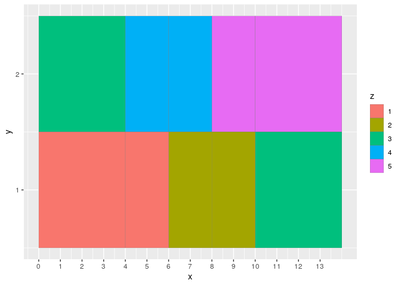

Experimenting with geom_tile
================

-   [Introduction](#introduction)
    -   [Plots](#plots)
    -   [Session info](#session-info)

# Introduction

Making plots with
[geom_tile](https://ggplot2.tidyverse.org/reference/geom_tile.html).

## Plots

Example data from the documentation.

``` r
df <- data.frame(
  x = rep(c(2, 5, 7, 9, 12), 2),
  y = rep(c(1, 2), each = 5),
  z = factor(rep(1:5, each = 2)),
  w = rep(diff(c(0, 4, 6, 8, 10, 14)), 2)
)

df
```

    ##     x y z w
    ## 1   2 1 1 4
    ## 2   5 1 1 2
    ## 3   7 1 2 2
    ## 4   9 1 2 2
    ## 5  12 1 3 4
    ## 6   2 2 3 4
    ## 7   5 2 4 2
    ## 8   7 2 4 2
    ## 9   9 2 5 2
    ## 10 12 2 5 4

Plot rectangles with default width.

``` r
my_interval <- 1
ggplot(df, aes(x, y)) +
  geom_tile(aes(fill = z), colour = "grey50") +
  scale_x_continuous(breaks = round(seq(0, max(df$x)+1, by = my_interval))) +
  scale_y_continuous(breaks = round(seq(0, max(df$y), by = my_interval)))
```

<!-- -->

Plot rectangles with default width.

``` r
my_interval <- 1
ggplot(df, aes(x, y, width = w)) +
  geom_tile(aes(fill = z), colour = "grey50") +
  scale_x_continuous(breaks = round(seq(0, max(df$x)+1, by = my_interval))) +
  scale_y_continuous(breaks = round(seq(0, max(df$y), by = my_interval)))
```

<!-- -->

To draw squares, use `coord_fixed()`; to create a border around each
“cell”, decrease the `width` and `height` slightly, and use `linewidth`.

``` r
df2 <- data.frame(
  x = rep(seq(from = 1, to = 9, by = 2), 2),
  y = rep(c(1, 3), each = 5),
  z = factor(rep(1:2, each = 5)),
  ranking = 1:10
)

my_interval <- 1
ggplot(df2, aes(x, y)) +
  geom_tile(aes(fill = z, width = 1.9, height = 1.9), colour = "black", linewidth = 1) +
  coord_fixed() +
  theme_void() +
  theme(legend.position = "none")
```

<!-- -->

Add text to each “cell” using `geom_text()`.

``` r
my_interval <- 1
ggplot(df2, aes(x, y)) +
  geom_tile(aes(fill = z, width = 1.9, height = 1.9), colour = "black", linewidth = 1) +
  geom_text(aes(x, y, label = ranking), size = 5) +
  coord_fixed() +
  theme_void() +
  theme(legend.position = "none")
```

<!-- -->

Gradient colour using `scale_fill_gradient()`.

``` r
my_interval <- 1
ggplot(df2, aes(x, y)) +
  geom_tile(aes(fill = ranking, width = 1.9, height = 1.9), colour = "black", linewidth = 1) +
  geom_text(aes(x, y, label = ranking), size = 5) +
  coord_fixed() +
  theme_void() +
  theme(legend.position = "none") +
  scale_fill_gradient(low = "yellow", high = "red")
```

<!-- -->

Use `RColorBrewer::display.brewer.all()` to find a nice palette and then
use `RColorBrewer::brewer.pal()` to generate the colours. Change
`ranking` into a factor and then use `scale_fill_discrete()` for
discrete colouring.

``` r
n <- length(unique(df2$ranking))

my_interval <- 1
ggplot(df2, aes(x, y)) +
  geom_tile(aes(fill = factor(ranking), width = 1.9, height = 1.9), colour = "black", linewidth = 1) +
  geom_text(aes(x, y, label = ranking), size = 5) +
  coord_fixed() +
  theme_void() +
  theme(legend.position = "none") +
  scale_fill_discrete(RColorBrewer::brewer.pal(n, "Set3"))
```

<!-- -->

## Session info

This document was generated by running `geom_tile.Rmd` in RStudio
Server.

    ## [1] "2023-01-26 06:02:01 UTC"

Session info.

    ## R version 4.2.0 (2022-04-22)
    ## Platform: x86_64-pc-linux-gnu (64-bit)
    ## Running under: Ubuntu 20.04.4 LTS
    ## 
    ## Matrix products: default
    ## BLAS:   /usr/lib/x86_64-linux-gnu/openblas-pthread/libblas.so.3
    ## LAPACK: /usr/lib/x86_64-linux-gnu/openblas-pthread/liblapack.so.3
    ## 
    ## locale:
    ##  [1] LC_CTYPE=en_US.UTF-8       LC_NUMERIC=C              
    ##  [3] LC_TIME=en_US.UTF-8        LC_COLLATE=en_US.UTF-8    
    ##  [5] LC_MONETARY=en_US.UTF-8    LC_MESSAGES=en_US.UTF-8   
    ##  [7] LC_PAPER=en_US.UTF-8       LC_NAME=C                 
    ##  [9] LC_ADDRESS=C               LC_TELEPHONE=C            
    ## [11] LC_MEASUREMENT=en_US.UTF-8 LC_IDENTIFICATION=C       
    ## 
    ## attached base packages:
    ## [1] stats     graphics  grDevices utils     datasets  methods   base     
    ## 
    ## other attached packages:
    ## [1] ggplot2_3.4.0
    ## 
    ## loaded via a namespace (and not attached):
    ##  [1] RColorBrewer_1.1-3 pillar_1.8.1       compiler_4.2.0     highr_0.9         
    ##  [5] tools_4.2.0        digest_0.6.30      evaluate_0.17      lifecycle_1.0.3   
    ##  [9] tibble_3.1.8       gtable_0.3.1       pkgconfig_2.0.3    rlang_1.0.6       
    ## [13] cli_3.4.1          DBI_1.1.3          rstudioapi_0.14    yaml_2.3.6        
    ## [17] xfun_0.34          fastmap_1.1.0      withr_2.5.0        stringr_1.4.1     
    ## [21] dplyr_1.0.10       knitr_1.40         generics_0.1.3     vctrs_0.5.0       
    ## [25] grid_4.2.0         tidyselect_1.2.0   glue_1.6.2         R6_2.5.1          
    ## [29] fansi_1.0.3        rmarkdown_2.17     farver_2.1.1       magrittr_2.0.3    
    ## [33] scales_1.2.1       htmltools_0.5.3    assertthat_0.2.1   colorspace_2.0-3  
    ## [37] labeling_0.4.2     utf8_1.2.2         stringi_1.7.8      munsell_0.5.0
