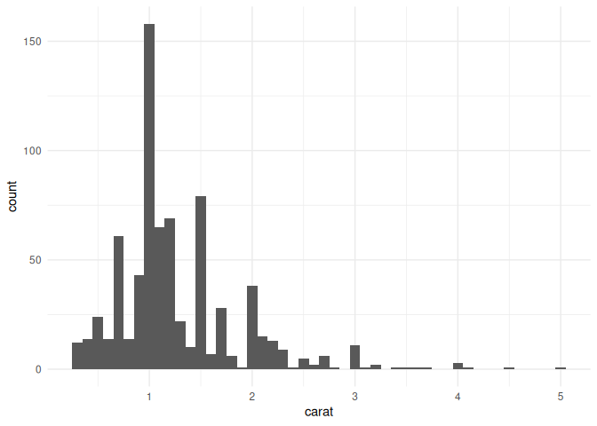

Iteration
================

- [Iterating using {dplyr} and
  {purrr}](#iterating-using-dplyr-and-purrr)
  - [Working with multiple columns](#working-with-multiple-columns)
  - [Pivot longer](#pivot-longer)
  - [Reading multiple files](#reading-multiple-files)
  - [Saving multiple plots](#saving-multiple-plots)
  - [Session info](#session-info)

# Iterating using {dplyr} and {purrr}

Ways to iterate using packages from the Tidyverse.

## Working with multiple columns

Use `across()`

``` r
mtcars |>
  summarise(
    n = n(),
    across(mpg:qsec, median)
  )
```

    ##    n  mpg cyl  disp  hp  drat    wt  qsec
    ## 1 32 19.2   6 196.3 123 3.695 3.325 17.71

Multiple functions by using a list (and modifying column names by using
`.names`).

``` r
mtcars |>
  summarise(
    across(
      mpg:qsec,
      list(
        mean = mean,
        median = median
      ),
      .names = "{.fn}_{.col}"
    )
  )
```

    ##   mean_mpg median_mpg mean_cyl median_cyl mean_disp median_disp  mean_hp
    ## 1 20.09062       19.2   6.1875          6  230.7219       196.3 146.6875
    ##   median_hp mean_drat median_drat mean_wt median_wt mean_qsec median_qsec
    ## 1       123  3.596563       3.695 3.21725     3.325  17.84875       17.71

Use `where()` to filter columns.

``` r
ChickWeight |>
  summarise(
    across(where(is.double), mean)
  )
```

    ##     weight     Time
    ## 1 121.8183 10.71799

## Pivot longer

Compare `across` with `pivot_longer`.

``` r
mtcars |>
  summarise(
    across(mpg:qsec, median)
  )
```

    ##    mpg cyl  disp  hp  drat    wt  qsec
    ## 1 19.2   6 196.3 123 3.695 3.325 17.71

Using `pivot_longer` is useful if `across` isn’t flexible enough.

``` r
mtcars |>
  pivot_longer(mpg:qsec) |>
  group_by(name) |>
  summarise(median = median(value))
```

    ## # A tibble: 7 × 2
    ##   name  median
    ##   <chr>  <dbl>
    ## 1 cyl     6   
    ## 2 disp  196.  
    ## 3 drat    3.70
    ## 4 hp    123   
    ## 5 mpg    19.2 
    ## 6 qsec   17.7 
    ## 7 wt      3.32

## Reading multiple files

[Create multiple
files](https://davetang.org/muse/2023/06/23/reading-list-of-files-into-single-r-data-frame/).

``` r
random_df <- function(num_row = 100, num_col = 100, seed = 1984){
  set.seed(seed)
  matrix(
    data = 
      runif(
        n = num_row * num_col,
        min = 0,
        max = 1
      ),
    nrow = num_row
  ) |> as.data.frame()
}

random_files <- function(nfiles, prefix = 'x', outdir = 'random', leading_zero = 6){
  if(!dir.exists(outdir)){
    dir.create(outdir)
  }
  purrr::map(1:nfiles, function(x){
    write.csv(
      x = random_df(seed = x),
      file = paste0(outdir, '/', prefix, stringr::str_pad(x, leading_zero, pad = 0), ".csv"),
      row.names = FALSE
    )
  }) -> dev_null
}

random_files(5)

list.files("random")
```

    ## [1] "x000001.csv" "x000002.csv" "x000003.csv" "x000004.csv" "x000005.csv"

Read the files using `list_rbind`; remember to use `set_names` first and
the `names_to` parameter.

``` r
list.files(path = "random", pattern = "csv$", full.names = TRUE) |>
  purrr::set_names(basename) |>
  purrr::map(readr::read_csv, show_col_types = FALSE) |>
  purrr::list_rbind(names_to = "file") -> my_df

dim(my_df)
```

    ## [1] 500 101

Take a look at the data frame.

``` r
head(my_df)
```

    ## # A tibble: 6 × 101
    ##   file       V1    V2    V3     V4    V5    V6    V7     V8     V9    V10    V11
    ##   <chr>   <dbl> <dbl> <dbl>  <dbl> <dbl> <dbl> <dbl>  <dbl>  <dbl>  <dbl>  <dbl>
    ## 1 x00000… 0.266 0.655 0.268 0.674  0.659 0.554 0.814 0.930  0.859  0.832  0.531 
    ## 2 x00000… 0.372 0.353 0.219 0.0949 0.185 0.688 0.929 0.901  0.0344 0.767  0.685 
    ## 3 x00000… 0.573 0.270 0.517 0.493  0.954 0.658 0.147 0.751  0.971  0.273  0.383 
    ## 4 x00000… 0.908 0.993 0.269 0.462  0.898 0.663 0.750 0.677  0.745  0.188  0.955 
    ## 5 x00000… 0.202 0.633 0.181 0.375  0.944 0.472 0.976 0.648  0.273  0.226  0.118 
    ## 6 x00000… 0.898 0.213 0.519 0.991  0.724 0.970 0.975 0.0732 0.677  0.0620 0.0391
    ## # ℹ 89 more variables: V12 <dbl>, V13 <dbl>, V14 <dbl>, V15 <dbl>, V16 <dbl>,
    ## #   V17 <dbl>, V18 <dbl>, V19 <dbl>, V20 <dbl>, V21 <dbl>, V22 <dbl>,
    ## #   V23 <dbl>, V24 <dbl>, V25 <dbl>, V26 <dbl>, V27 <dbl>, V28 <dbl>,
    ## #   V29 <dbl>, V30 <dbl>, V31 <dbl>, V32 <dbl>, V33 <dbl>, V34 <dbl>,
    ## #   V35 <dbl>, V36 <dbl>, V37 <dbl>, V38 <dbl>, V39 <dbl>, V40 <dbl>,
    ## #   V41 <dbl>, V42 <dbl>, V43 <dbl>, V44 <dbl>, V45 <dbl>, V46 <dbl>,
    ## #   V47 <dbl>, V48 <dbl>, V49 <dbl>, V50 <dbl>, V51 <dbl>, V52 <dbl>, …

## Saving multiple plots

Create example dataset using diamonds and `group_nest`, which nests a
tibble using a grouping specification .

``` r
diamonds |>
  group_nest(clarity) -> by_clarity

str(by_clarity, max.level = 4)
```

    ## tibble [8 × 2] (S3: tbl_df/tbl/data.frame)
    ##  $ clarity: Ord.factor w/ 8 levels "I1"<"SI2"<"SI1"<..: 1 2 3 4 5 6 7 8
    ##  $ data   : list<tibble[,9]> [1:8] 
    ##   ..$ : tibble [741 × 9] (S3: tbl_df/tbl/data.frame)
    ##   ..$ : tibble [9,194 × 9] (S3: tbl_df/tbl/data.frame)
    ##   ..$ : tibble [13,065 × 9] (S3: tbl_df/tbl/data.frame)
    ##   ..$ : tibble [12,258 × 9] (S3: tbl_df/tbl/data.frame)
    ##   ..$ : tibble [8,171 × 9] (S3: tbl_df/tbl/data.frame)
    ##   ..$ : tibble [5,066 × 9] (S3: tbl_df/tbl/data.frame)
    ##   ..$ : tibble [3,655 × 9] (S3: tbl_df/tbl/data.frame)
    ##   ..$ : tibble [1,790 × 9] (S3: tbl_df/tbl/data.frame)
    ##   ..@ ptype: tibble [0 × 9] (S3: tbl_df/tbl/data.frame)

Create histogram.

``` r
carat_histogram <- function(df){
  ggplot(df, aes(x = carat)) +
    geom_histogram(binwidth = 0.1) +
    theme_minimal()
}

carat_histogram(by_clarity$data[[1]])
```

<!-- -->

Now use `map()` to create a list of plots.

``` r
by_clarity |>
  mutate(
    plot = purrr::map(data, carat_histogram),
    path = stringr::str_glue("clarity-{clarity}.png")
  ) -> by_clarity

colnames(by_clarity)
```

    ## [1] "clarity" "data"    "plot"    "path"

Use `walk2()` and `ggsave()` to save each plot; `walk()` and `walk2()`
does the same thing as `map()` but throws the output away, which is nice
for saving plots. (The `\` used below is just a shortcut for
`function`.)

``` r
walk2(
  by_clarity$path,
  by_clarity$plot,
  \(path, plot) ggsave(path, plot, width = 6, height = 6)
)
```

Remove the images after the demo.

``` r
file.remove(by_clarity$path)
```

    ## [1] TRUE TRUE TRUE TRUE TRUE TRUE TRUE TRUE

## Session info

Session info.

    ## R version 4.5.0 (2025-04-11)
    ## Platform: x86_64-pc-linux-gnu
    ## Running under: Ubuntu 24.04.2 LTS
    ## 
    ## Matrix products: default
    ## BLAS:   /usr/lib/x86_64-linux-gnu/openblas-pthread/libblas.so.3 
    ## LAPACK: /usr/lib/x86_64-linux-gnu/openblas-pthread/libopenblasp-r0.3.26.so;  LAPACK version 3.12.0
    ## 
    ## locale:
    ##  [1] LC_CTYPE=en_US.UTF-8       LC_NUMERIC=C              
    ##  [3] LC_TIME=en_US.UTF-8        LC_COLLATE=en_US.UTF-8    
    ##  [5] LC_MONETARY=en_US.UTF-8    LC_MESSAGES=en_US.UTF-8   
    ##  [7] LC_PAPER=en_US.UTF-8       LC_NAME=C                 
    ##  [9] LC_ADDRESS=C               LC_TELEPHONE=C            
    ## [11] LC_MEASUREMENT=en_US.UTF-8 LC_IDENTIFICATION=C       
    ## 
    ## time zone: Etc/UTC
    ## tzcode source: system (glibc)
    ## 
    ## attached base packages:
    ## [1] stats     graphics  grDevices utils     datasets  methods   base     
    ## 
    ## other attached packages:
    ##  [1] lubridate_1.9.4 forcats_1.0.0   stringr_1.5.1   dplyr_1.1.4    
    ##  [5] purrr_1.0.4     readr_2.1.5     tidyr_1.3.1     tibble_3.2.1   
    ##  [9] ggplot2_3.5.2   tidyverse_2.0.0
    ## 
    ## loaded via a namespace (and not attached):
    ##  [1] bit_4.6.0          gtable_0.3.6       crayon_1.5.3       compiler_4.5.0    
    ##  [5] tidyselect_1.2.1   parallel_4.5.0     textshaping_1.0.1  systemfonts_1.2.3 
    ##  [9] scales_1.4.0       yaml_2.3.10        fastmap_1.2.0      R6_2.6.1          
    ## [13] labeling_0.4.3     generics_0.1.4     knitr_1.50         pillar_1.10.2     
    ## [17] RColorBrewer_1.1-3 tzdb_0.5.0         rlang_1.1.6        utf8_1.2.5        
    ## [21] stringi_1.8.7      xfun_0.52          bit64_4.6.0-1      timechange_0.3.0  
    ## [25] cli_3.6.5          withr_3.0.2        magrittr_2.0.3     digest_0.6.37     
    ## [29] grid_4.5.0         vroom_1.6.5        hms_1.1.3          lifecycle_1.0.4   
    ## [33] vctrs_0.6.5        evaluate_1.0.3     glue_1.8.0         farver_2.1.2      
    ## [37] ragg_1.4.0         rmarkdown_2.29     tools_4.5.0        pkgconfig_2.0.3   
    ## [41] htmltools_0.5.8.1
