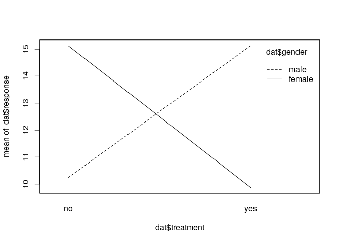
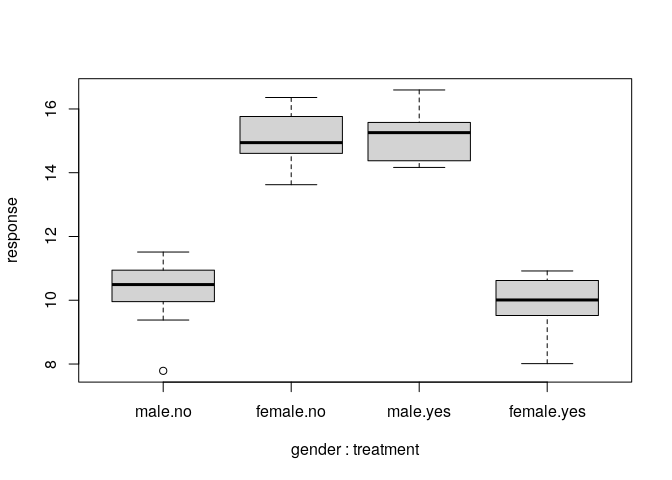
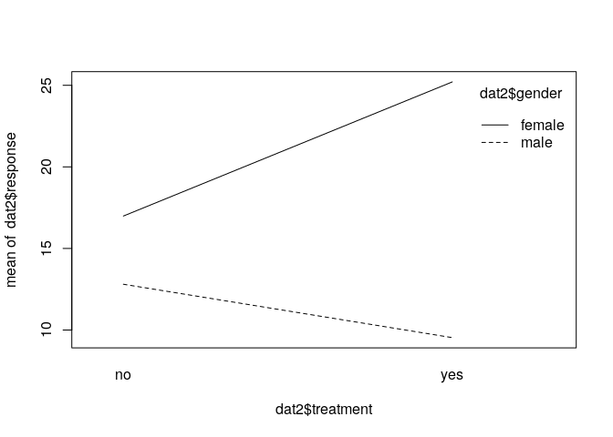
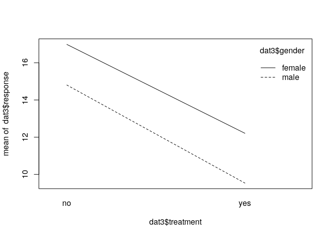

Understanding two-way interactions
================

-   [Introduction](#introduction)
    -   [Data](#data)
    -   [Results](#results)
    -   [Session info](#session-info)

# Introduction

Notes adapted from [Understanding 2-way
Interactions](https://data.library.virginia.edu/understanding-2-way-interactions/).

It is useful to examine whether or not the effect of one variable
depends on the level of one or more variables when performing linear
regression or ANOVA. It there is an effect, we have what is called an
“interaction” and this means variables combine or interact to affect the
response. The simplest type of interaction is between two two-level
categorical variables such as gender (male or female), treatment (yes or
no), and a continuous response. If the response to treatment depends on
gender, then there is an interaction.

## Data

Generate gender factor using `gl()` (function to generate factor
levels).

``` r
gender <- gl(n = 2, k = 20, labels = c("male","female"))
gender
```

    ##  [1] male   male   male   male   male   male   male   male   male   male  
    ## [11] male   male   male   male   male   male   male   male   male   male  
    ## [21] female female female female female female female female female female
    ## [31] female female female female female female female female female female
    ## Levels: male female

Generate treatment factor.

``` r
treatment <- as.factor(rep(c("yes","no"), each = 10, times = 2))
treatment
```

    ##  [1] yes yes yes yes yes yes yes yes yes yes no  no  no  no  no  no  no  no  no 
    ## [20] no  yes yes yes yes yes yes yes yes yes yes no  no  no  no  no  no  no  no 
    ## [39] no  no 
    ## Levels: no yes

Generate response by sampling from two different normal distributions,
one with mean 15 and another with mean 10. We create an interaction by
sampling from the distributions in a different order for each gender.

``` r
set.seed(1)
response <- c(
  rnorm(n = 20, mean = rep(c(15,10), each = 10)),
  rnorm(n = 20, mean = rep(c(10,15), each = 10))
)

response
```

    ##  [1] 14.373546 15.183643 14.164371 16.595281 15.329508 14.179532 15.487429
    ##  [8] 15.738325 15.575781 14.694612 11.511781 10.389843  9.378759  7.785300
    ## [15] 11.124931  9.955066  9.983810 10.943836 10.821221 10.593901 10.918977
    ## [22] 10.782136 10.074565  8.010648 10.619826  9.943871  9.844204  8.529248
    ## [29]  9.521850 10.417942 16.358680 14.897212 15.387672 14.946195 13.622940
    ## [36] 14.585005 14.605710 14.940687 16.100025 15.763176

Combine into a data frame.

``` r
dat <- data.frame(gender, treatment, response)
head(dat)
```

    ##   gender treatment response
    ## 1   male       yes 14.37355
    ## 2   male       yes 15.18364
    ## 3   male       yes 14.16437
    ## 4   male       yes 16.59528
    ## 5   male       yes 15.32951
    ## 6   male       yes 14.17953

## Results

Check mean response based on the two main effects, which appear to have
no effect on the mean response value.

``` r
aggregate(response ~ gender, data = dat, mean)
```

    ##   gender response
    ## 1   male 12.69052
    ## 2 female 12.49353

``` r
aggregate(response ~ treatment, data = dat, mean)
```

    ##   treatment response
    ## 1        no 12.68479
    ## 2       yes 12.49926

We can check the interaction by calculating the mean response with both
variables. The treatment effect depends on gender; in males, the
treatment causes the mean response to increase by about 5 and in
females, the treatment causes the mean response to decrease by about 5.

``` r
dat %>%
  group_by(gender, treatment) %>%
  summarise(mean = mean(response))
```

    ## `summarise()` has grouped output by 'gender'. You can override using the
    ## `.groups` argument.

    ## # A tibble: 4 × 3
    ## # Groups:   gender [2]
    ##   gender treatment  mean
    ##   <fct>  <fct>     <dbl>
    ## 1 male   no        10.2 
    ## 2 male   yes       15.1 
    ## 3 female no        15.1 
    ## 4 female yes        9.87

An interaction plot is useful for visualising interactions. `x.factor`
is the variable to be plotted on the x-axis; `trace.factor` is how you
want to group the lines; and `response` is the response variable.

``` r
interaction.plot(
  x.factor = dat$treatment,
  trace.factor = dat$gender,
  response = dat$response
)
```

<!-- -->

The resulting plot results in lines that cross, which indicate an
interaction. A very strong interaction has lines that are nearly
perpendicular as above. An interaction where the lines cross is
sometimes called an “interference” or “antagonistic” interaction effect.

We can also use box plots to visualise interactions. The formula below
specifies that `response` should be plotted by the interaction of
`gender` and `treatment`. By interacting two two-level variables, we get
a new four-level variable.

``` r
boxplot(response ~ gender * treatment, data = dat)
```

<!-- -->

A common method for analysing the effect of categorical variables on a
continuous response variable is using the Analysis of Variance (ANOVA).
The formula below is interpreted as: model response as a function of
gender, treatment, and the interaction of gender and treatment.

``` r
aov1 <- aov(response ~ treatment * gender, data = dat)
summary(aov1)
```

    ##                  Df Sum Sq Mean Sq F value Pr(>F)    
    ## treatment         1   0.34    0.34   0.415  0.524    
    ## gender            1   0.39    0.39   0.468  0.499    
    ## treatment:gender  1 256.94  256.94 309.548 <2e-16 ***
    ## Residuals        36  29.88    0.83                   
    ## ---
    ## Signif. codes:  0 '***' 0.001 '**' 0.01 '*' 0.05 '.' 0.1 ' ' 1

The main effects by themselves are not significant but their interaction
is, i.e. mean response is substantially different when both variables
were combined.

The `model.tables()` function reports the grand mean, the means by main
effects, and the means by the interaction.

``` r
model.tables(aov1, type = "means")
```

    ## Tables of means
    ## Grand mean
    ##          
    ## 12.59203 
    ## 
    ##  treatment 
    ## treatment
    ##     no    yes 
    ## 12.685 12.499 
    ## 
    ##  gender 
    ## gender
    ##   male female 
    ## 12.691 12.494 
    ## 
    ##  treatment:gender 
    ##          gender
    ## treatment male   female
    ##       no  10.249 15.121
    ##       yes 15.132  9.866

We can fit a linear model using the `lm()` function.

``` r
lm1 <- lm(response ~ treatment * gender, data = dat)
summary(lm1)
```

    ## 
    ## Call:
    ## lm(formula = response ~ treatment * gender, data = dat)
    ## 
    ## Residuals:
    ##     Min      1Q  Median      3Q     Max 
    ## -2.4635 -0.4570  0.1093  0.6152  1.4631 
    ## 
    ## Coefficients:
    ##                           Estimate Std. Error t value Pr(>|t|)    
    ## (Intercept)                10.2488     0.2881   35.57  < 2e-16 ***
    ## treatmentyes                4.8834     0.4074   11.98 3.98e-14 ***
    ## genderfemale                4.8719     0.4074   11.96 4.26e-14 ***
    ## treatmentyes:genderfemale -10.1378     0.5762  -17.59  < 2e-16 ***
    ## ---
    ## Signif. codes:  0 '***' 0.001 '**' 0.01 '*' 0.05 '.' 0.1 ' ' 1
    ## 
    ## Residual standard error: 0.9111 on 36 degrees of freedom
    ## Multiple R-squared:  0.8961, Adjusted R-squared:  0.8874 
    ## F-statistic: 103.5 on 3 and 36 DF,  p-value: < 2.2e-16

The table of coefficients indicates that everything is significant,
which just means the coefficients are significantly different from 0. It
does not mean the main effects are significant and if we want a test for
the significance of main effects, we should use `anova(lm1)`, which
generates the same ANOVA table using `aov`.

``` r
anova(lm1)
```

    ## Analysis of Variance Table
    ## 
    ## Response: response
    ##                  Df  Sum Sq Mean Sq  F value Pr(>F)    
    ## treatment         1   0.344   0.344   0.4147 0.5237    
    ## gender            1   0.388   0.388   0.4675 0.4985    
    ## treatment:gender  1 256.936 256.936 309.5479 <2e-16 ***
    ## Residuals        36  29.881   0.830                    
    ## ---
    ## Signif. codes:  0 '***' 0.001 '**' 0.01 '*' 0.05 '.' 0.1 ' ' 1

The intercept in the linear model output is the mean response for
gender=“male” and treatment=“no”. The coefficient for “genderfemale” is
what you add to the intercept to get the mean response for
gender=“female” when treatment=“no”.

Another type of interaction is when the variables combine to amplify an
effect.

``` r
set.seed(12)
response <- c(
  rnorm(n = 20, mean = rep(c(10,13), each = 10)),
  rnorm(n = 20, mean = rep(c(25,17), each = 10))
)

dat2 <- data.frame(gender, treatment, response)
interaction.plot(
  x.factor = dat2$treatment, 
  trace.factor = dat2$gender,
  response = dat2$response
)
```

<!-- -->

This type of interaction is sometimes called a “reinforcement” or
“synergistic” interaction effect. We observe a difference between
genders when treatment=“no”, but that difference is reinforced when
treatment=“yes” for each gender.

Running an ANOVA reveals that the main effects are significant as well.
The effects of gender and treatment individually explain a fair amount
of variability in the data.

``` r
aov2 <- aov(response ~ treatment * gender, data = dat2)
summary(aov2)
```

    ##                  Df Sum Sq Mean Sq F value   Pr(>F)    
    ## treatment         1   61.3    61.3   77.36 1.71e-10 ***
    ## gender            1  985.8   985.8 1244.88  < 2e-16 ***
    ## treatment:gender  1  330.3   330.3  417.09  < 2e-16 ***
    ## Residuals        36   28.5     0.8                     
    ## ---
    ## Signif. codes:  0 '***' 0.001 '**' 0.01 '*' 0.05 '.' 0.1 ' ' 1

Finally we generate data where there is no interaction; the means of the
distribution change for each treatment but the difference between them
does not change for each gender.

``` r
set.seed(12)
response <- c(
  rnorm(n = 20, mean = rep(c(10,15), each = 10)),
  rnorm(n = 20, mean = rep(c(12,17), each = 10))
)

dat3 <- data.frame(gender, treatment, response)
interaction.plot(
  x.factor = dat3$treatment, 
  trace.factor = dat3$gender,
  response = dat3$response
)
```

<!-- -->

The lines are parallel indicating the absence of an interaction effect;
the effect of treatment does not depend on gender, which we observe in
the ANOVA.

``` r
summary(aov(response ~ treatment * gender, data = dat3))
```

    ##                  Df Sum Sq Mean Sq F value   Pr(>F)    
    ## treatment         1 252.50  252.50 318.850  < 2e-16 ***
    ## gender            1  58.99   58.99  74.497 2.72e-10 ***
    ## treatment:gender  1   0.61    0.61   0.771    0.386    
    ## Residuals        36  28.51    0.79                     
    ## ---
    ## Signif. codes:  0 '***' 0.001 '**' 0.01 '*' 0.05 '.' 0.1 ' ' 1

## Session info

This README was generated by running `readme.Rmd` in RStudio Server.

    ## [1] "2023-01-04 07:37:30 UTC"

Session info.

    ## R version 4.2.0 (2022-04-22)
    ## Platform: x86_64-pc-linux-gnu (64-bit)
    ## Running under: Ubuntu 20.04.4 LTS
    ## 
    ## Matrix products: default
    ## BLAS:   /usr/lib/x86_64-linux-gnu/openblas-pthread/libblas.so.3
    ## LAPACK: /usr/lib/x86_64-linux-gnu/openblas-pthread/liblapack.so.3
    ## 
    ## locale:
    ##  [1] LC_CTYPE=en_US.UTF-8       LC_NUMERIC=C              
    ##  [3] LC_TIME=en_US.UTF-8        LC_COLLATE=en_US.UTF-8    
    ##  [5] LC_MONETARY=en_US.UTF-8    LC_MESSAGES=en_US.UTF-8   
    ##  [7] LC_PAPER=en_US.UTF-8       LC_NAME=C                 
    ##  [9] LC_ADDRESS=C               LC_TELEPHONE=C            
    ## [11] LC_MEASUREMENT=en_US.UTF-8 LC_IDENTIFICATION=C       
    ## 
    ## attached base packages:
    ## [1] stats     graphics  grDevices utils     datasets  methods   base     
    ## 
    ## other attached packages:
    ## [1] dplyr_1.0.10
    ## 
    ## loaded via a namespace (and not attached):
    ##  [1] rstudioapi_0.14  knitr_1.40       magrittr_2.0.3   tidyselect_1.2.0
    ##  [5] R6_2.5.1         rlang_1.0.6      fastmap_1.1.0    fansi_1.0.3     
    ##  [9] highr_0.9        stringr_1.4.1    tools_4.2.0      xfun_0.34       
    ## [13] utf8_1.2.2       cli_3.4.1        DBI_1.1.3        htmltools_0.5.3 
    ## [17] yaml_2.3.6       digest_0.6.30    assertthat_0.2.1 tibble_3.1.8    
    ## [21] lifecycle_1.0.3  vctrs_0.5.0      glue_1.6.2       evaluate_0.17   
    ## [25] rmarkdown_2.17   stringi_1.7.8    compiler_4.2.0   pillar_1.8.1    
    ## [29] generics_0.1.3   pkgconfig_2.0.3
